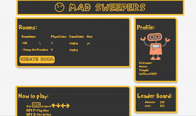

# MadSweeper
Website: www.madsweepers.com

## Table of Contents

1. [Game](#Game)
2. [Stack](#stack)
3. [Development](#development)
  -  [Installing Dependencies](#installing-dependencies)
4. [Team](#team)
5. [Contributing](#contributing)

## Game Overview

Connect and play minesweeper on steroids! Multi-player, sabotage your friends edition.

 

## Game Play

- Arrow keys to move
- Space to reveal tiles
- 'a' to make the other players dance
- 's' to plant a banana
- 'd' to shoot bullets
- 'f' to mark mines.


## Tech Stack

- Front End: React, Redux, Babel, Webpack
- Back End: Node, Express, Socket.io, Redis, AWS
- Test Suite: Chai, Mocha, Sinon, JsDom

More details are available in ./documentation/Madsweepers overview.pdf


## Development

### Installing Dependencies

From within the root directory:

```sh
npm install
npm start
```

From within the client-web directory:

```sh
npm install
npm run dev
```

## Team

  - __Product Owner__: Tim Zeng
  - __Scrum Master__: Bruce Yang
  - __Development Team Members__: MJ Png, David Minehan


## Contributing

See [CONTRIBUTING.md](CONTRIBUTING.md) for contribution guidelines.